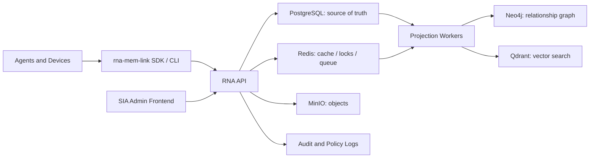

# RNA Strategic Architecture

Last updated: 2026-05-21

## Purpose

RNA is the shared memory and coordination brain for Mauricio, SIA, Claude, Codex, Gemini, Ollama, IDE agents, mobile devices, home servers, and future unknown agents.

The goal is not just to store notes. The goal is to reduce repeated personalization, prevent context loss between chats and tools, save tokens by reusing solved knowledge, and let SIA govern dashboard views over an ordered hive of agents that can learn from work, errors, tasks, and the real world.

RNA should be simple to modify and grow, like Firebase-style collections, but navigable as a memory palace. See `docs/COLLECTIONS_AND_MEMORY_PALACE.md`.

## Core Principles

1. RNA must always accept memory writes, even when graph/vector/cache services are degraded.
2. There must be one source of truth. Derived stores can be rebuilt.
3. Agents receive short context injections, not raw history dumps.
4. SIA is the memory governor through dashboard views, policy, approvals, pruning, task ownership, and sensitive-memory review. RNA must not replace or alter SIA's own memory system.
5. Every agent/device has identity, permissions, audit logs, and revocable tokens.
6. Secrets, raw private logs, and noisy transcripts are not memory. Summaries and reusable lessons are memory.
7. RNA should become more valuable over time without making every request expensive.

## Current Stack Assessment

Current services:

- Express/TypeScript API
- PostgreSQL
- Neo4j
- Qdrant
- Redis
- MinIO
- Docker Compose

This is powerful, but operationally fragile if all services are treated as required for the basic memory path. Recent Docker issues also show that rebuild/recreate operations must be made safer and more deterministic.

### Main Risks

- Several images are floating tags or effectively unpinned (`latest`, broad major tags).
- API writes currently depend too directly on Neo4j for facts.
- Docker build/recreate can block the host and make recovery hard.
- Auth exists, but pairing secret configuration and device lifecycle need stronger operational docs.
- There is no frontend for SIA/admin review, task governance, or memory hygiene.
- There is no explicit sync queue for offline agent writes.

## Recommended Database Strategy

### Source Of Truth: PostgreSQL

Use PostgreSQL as the canonical system of record for facts, memories, tasks, agents/devices, auth sessions, execution traces, memory revisions, approvals, sync queue/outbox, and audit events.

PostgreSQL is the safest core because it is durable, simple to back up, easy to query, and enough for most operational facts. If vector search should be simplified later, `pgvector` can be evaluated before keeping Qdrant as mandatory infrastructure.

### Graph Projection: Neo4j

Neo4j is valuable for relationships: person -> project -> device -> task, agent -> capability -> solved error, home device -> room -> automation, and company -> contact -> invoice -> obligation.

But Neo4j should be a derived projection, not the only place a fact exists. If Neo4j is down, RNA should still write to PostgreSQL and enqueue graph projection work.

### Vector Projection: Qdrant

Qdrant is valuable for semantic retrieval, especially known fixes, preferences, project context, and similar memories.

But Qdrant should be rebuilt from canonical facts. If embeddings fail, store the fact first and mark vectorization pending.

### Cache/Queue: Redis

Redis should be used for short-lived bootstrap cache, job locks, rate limits, fast task counters, and optional queue backend. It should not hold irreplaceable memory.

### Object Storage: MinIO

MinIO should be used for screenshots, PDFs, logs deliberately attached to a memory, audio/video/transcripts, and exports. Facts should reference object IDs, not embed large payloads.

## Target Architecture



## Memory Model

Minimum canonical entities:

- `collections`: Firebase-like containers scoped to spaces.
- `documents`: flexible JSON documents inside collections.
- `spaces`: personal, empresarial, operacional, familia, casa, proyectos, agentes.
- `facts`: concise atomic memories.
- `memories`: curated facts promoted by SIA or trust policy.
- `tasks`: duties for `any`, `sia`, `claude`, `codex`, `gemini`, `ollama`, or specific devices.
- `agents`: identity, capabilities, trust level, device binding.
- `execution_traces`: commands, outcome, sanitized error, solved-by, reusable lesson.
- `agent_bitacora`: immutable append-only command and result ledger for every agent.
- `connectors`: integrations with IDEs, home server, chat apps, browsers, mobile.
- `memory_edges`: relationships between facts, tasks, people, projects, devices.
- `outbox`: pending projections/sync work.
- `audit_events`: who read/wrote/changed what.

### Session and topic model

RNA must treat memory as layered context, not as one giant timeline.

- `sessions`:
  - one operational session per agent run or work block.
  - contains start/end timestamps, agent id, current objective, and outcome.
  - can be resumed or superseded, but never silently overwritten.
- `topics`:
  - durable threads such as `gateway`, `sia-ui`, `ares-router`, `rna-admin`, `backup-recovery`, `accounting`, `affine`, `luckypixel`.
  - topics collect facts, traces, tasks, and relationships across sessions.
- `topic_relations`:
  - links between topics, e.g. `gateway -> sia`, `rna -> sia`, `ares -> gateway`, `backup-recovery -> rna-admin`.
  - relations should indicate whether the link is causal, dependency, shared-owner, follow-up, or learned-from.
- `handoff_cards`:
  - short agent-to-agent summaries used by the next agent or device.
  - answer: what changed, what is still broken, what to avoid, what to do next.

The UI should surface these layers separately so an agent can work from:

1. session summary,
2. topic summary,
3. related topics,
4. recent traces,
5. pending tasks,
6. and only then the raw facts if needed.

## Bootstrap Contract

Every agent should start meaningful work with:

```http
POST /v1/agents/bootstrap
```

The response should be token-budgeted:

- identity context
- current user/project preferences
- active tasks for that agent
- recent relevant decisions
- known error fixes
- links to large objects only when needed

Recommended limits:

- default injection: 500-1200 tokens
- high-context bootstrap: 2000-4000 tokens
- never raw logs by default

## Token Savings Strategy

1. Store solved errors as reusable patterns: command, error signature, root cause, fix, environment, and confidence.
2. Store successful workflows such as deploys, pairing, recovery, and common maintenance.
3. Use semantic retrieval only after filtering by agent, space, project, recency, and tags.
4. Generate daily, project, and per-agent summaries.
5. Expire or archive transient logs, duplicate facts, and obsolete fixes.
6. Save token budgets by shipping concise handoff cards and topic summaries before any raw trace dump.
7. Teach every agent to query RNA first for already-solved infrastructure, auth, proxy, and deployment failures.
8. Aim for at least 80% token reduction on repeat operational work by reusing session digests, topic memory, and solved-failure patterns.

## Auth And Trust

Recommended model:

- Device pairing with `RNA_PAIRING_SECRET`.
- Each paired device receives a revocable Bearer token.
- Agents have scopes such as `memory:read`, `memory:write`, `tasks:read`, `tasks:assign`, `admin:review`, and `home:control`.
- SIA can promote, quarantine, merge, or delete memories.
- Unknown agents can be read-only or write-to-review-queue only.
- High-impact actions, especially home control, require explicit policy gates.

## SIA Admin Frontend

The frontend should be a real operations console, not a marketing dashboard.

Views:

- Memory Inbox: new writes awaiting review.
- Agent Board: connected agents, trust level, last seen, scopes.
- Task Board: tasks by target agent, priority, source, status.
- Knowledge Graph: people, projects, devices, companies, obligations.
- Error Library: command failures and known fixes.
- Context Builder: preview what bootstrap will send to an agent.
- Sync Monitor: pending local writes, failed projections, stale devices.
- Home Control Readiness: devices, rooms, permissions, dry-run commands.
- Audit Log: who read/wrote/changed memory.
- Policy Studio: what agents may remember, forget, or execute.

The visual hierarchy should not be a flat list-first admin screen. It should feel closer to Obsidian + a control room:

- a top-level Memory Atlas with graph navigation,
- a session lane that shows what the current agent is doing,
- a topic lane that shows durable threads and related work,
- a handoff lane that explains what the next agent should do,
- and then drill-down panels for traces, facts, documents, and approvals.

Auth:

- Admin login for Mauricio/SIA.
- Device tokens for agents.
- Optional passkeys/OAuth later.
- Role-based access control from day one.

### Main panel behavior

The main panel should show:

- current session summary for the active agent,
- active topic,
- related topics and dependencies,
- what the last agent already completed,
- what remains blocked,
- what must not be repeated,
- and a compact bootstrap preview for the next agent/device.

The panel is not only a dashboard. It is the continuity layer between agents and devices.

## Deployment Recommendation

### Short Term

Keep Docker Compose, but make it deterministic:

- Pin all service images to explicit stable versions.
- Remove `latest`.
- Build API image in CI or a separate builder, then deploy by image tag.
- Avoid `docker compose build` on the production host when Docker is unstable.
- Add `RNA_PAIRING_SECRET` to `.env.example`.
- Add a deploy script that pulls, builds, restarts only `api`, and verifies `/health`, `/auth/pair`, and `/v1/agents/bootstrap`.

### Medium Term

Split infrastructure into profiles:

- `core`: api + postgres + redis
- `search`: qdrant + embedding worker
- `graph`: neo4j + graph worker
- `objects`: minio
- `admin`: frontend

The API must work in `core` mode.

### Long Term

Consider:

- systemd-managed API outside Docker if Docker remains host-fragile.
- managed PostgreSQL/backups if uptime becomes critical.
- separate worker processes for embeddings and graph projections.
- blue/green API deployments.
- automated disaster recovery tests.

## Stable Version Policy

Do not rely on floating tags. Use explicit versions and update intentionally:

- Node: current Active LTS only, pinned in Dockerfile.
- PostgreSQL: stable major, pinned; upgrade by migration plan.
- Redis: stable major, pinned.
- Neo4j: stable 5.x line unless a validated LTS target is chosen.
- Qdrant: pinned minor version, upgrade after rebuild test.
- MinIO: pinned release tag, not `latest`.

Version updates should be tracked in a compatibility matrix: image tag, smoke test, backup/restore result, migration impact, and rollback command.

## API Roadmap

Phase 1: Stabilize Core

- Make PostgreSQL canonical for facts/tasks/traces.
- Add collection/document APIs and map facts/tasks/agent traces onto them.
- Keep Neo4j/Qdrant writes asynchronous.
- Add `/v1/tasks`.
- Add `/v1/memory/search`.
- Add `/v1/sync/pending`.
- Add `/v1/agents/bootstrap` with token budget controls.
- Add integration tests for degraded Neo4j/Qdrant.

Phase 2: Admin Console

- Build frontend with login.
- Memory inbox and approval workflow.
- Agent/device management.
- Task board.
- Bootstrap preview.
- Error library.

Phase 3: Intelligence Layer

- SIA memory curator.
- SIA dashboard RNA views without modifying SIA's internal memory.
- Deduplication.
- Confidence scoring.
- Forget/archive policies.
- Cross-agent learning summaries.
- Project and person profiles.

Phase 4: Home And Real-World Control

- Home device registry.
- Permissioned command gateway.
- Dry-run mode.
- Safety approvals.
- Event history.
- SIA routines.

Phase 5: Ecosystem

- IDE plugin.
- Mobile companion.
- Browser extension.
- Claude/Codex/Gemini/Ollama adapters.
- Local-first sync for offline devices.
- Public protocol for future unknown agents.

## Immediate Action List

1. Stop production Docker rebuild experiments until Docker stability is reviewed.
2. Verify if `rna-api` is running the new `dist` and that `/v1/agents/bootstrap` returns `401` without token.
3. Add `RNA_PAIRING_SECRET` to `.env.example` and server `.env`.
4. Pair the Windows Codex device and store token locally.
5. Move facts write path to PostgreSQL first.
6. Convert Neo4j/Qdrant writes to background projection jobs.
7. Add a deployment script that never requires full stack rebuild for API-only changes.
8. Create frontend scaffold after core auth and memory APIs are stable.
9. Add backup/restore documentation for PostgreSQL, Neo4j, Qdrant, MinIO.
10. Add monitoring for Docker health, API latency, projection lag, and failed writes.

## Definition Of Success

RNA is successful when:

- A new agent on a new device can pair safely and learn who Mauricio is.
- Context follows Mauricio across chats, IDEs, devices, and agents.
- Solved errors are reused instead of rediscovered.
- SIA can assign and govern tasks across agents.
- Memory is searchable, reviewable, auditable, and correctable.
- Core memory survives degraded vector/graph/object services.
- Home automation can be connected later through explicit permissions.
